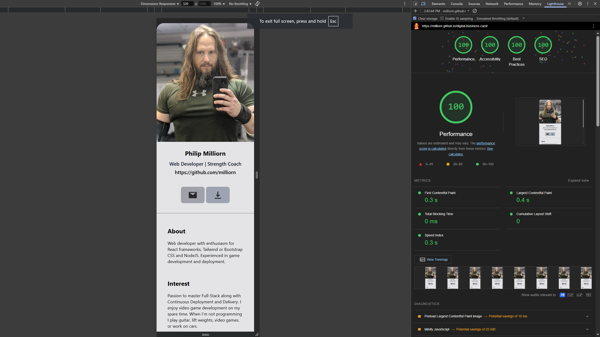

# Digital Business Card

Digital Business Card is a modern and responsive web application that allows users to create and share their digital business cards online. With this application, you can create a professional and interactive representation of your business card, including contact information, social media links, and a personal bio. It provides a convenient way for professionals to showcase their information and make lasting impressions with potential clients and contacts.

## Preview

## Features

- Create and customize your digital business card with ease
- Add your contact information, including name, email, phone number, and website
- Include links to your social media profiles, such as LinkedIn, Twitter, and GitHub
- Write a brief bio or introduction about yourself or your business
- Generate a unique URL to share your digital business card with others
- Responsive design for optimal viewing on desktop and mobile devices

## Technologies Used

- React: A JavaScript library for building user interfaces
- React Router: A popular routing library for React applications
- Firebase: A cloud-based platform for building web and mobile applications
- Firebase Authentication: For user authentication and authorization
- Firebase Firestore: A NoSQL document database for storing and retrieving data
- Material-UI: A popular React UI framework for creating beautiful user interfaces

## Getting Started

### Prerequisites

- Node.js: Make sure you have Node.js installed on your machine.

### Installation

1. Clone the repository: `git clone https://github.com/milliorn/Digital-Business-Card.git`
2. Navigate to the project directory: `cd Digital-Business-Card`
3. Install the dependencies: `npm install`
4. Set up a Firebase project:

- Create a new Firebase project at <https://firebase.google.com/>
- Enable Firebase Authentication and Firestore in the Firebase project console
- Add your Firebase project configuration details to the `.env` file

### Run Development Server

1. Start the development server: `npm start`
2. Open your browser and visit `http://localhost:3000` to access the application.

## Deployment

To deploy the application to a hosting platform, follow these steps:

1. Build the application: `npm run build`
2. Deploy the build folder to your hosting platform.

## License

This project is licensed under the MIT License. See the [LICENSE](LICENSE) file for details.

## Acknowledgements

- This project was inspired by the need for a modern and digital way to share business cards.
- Special thanks to the contributors who helped improve and enhance the application.

## Links

Get started with Tailwind CSS -> <https://tailwindcss.com/docs/installation>

React Icons -> <https://react-icons.github.io/react-icons>

React Image -> <https://github.com/mbrevda/react-image>

React Visibility Sensor -> <https://github.com/joshwnj/react-visibility-sensor>

This project was bootstrapped with [Create React App](https://github.com/facebook/create-react-app).

TypeScript -> <https://www.typescriptlang.org/docs/handbook/react.html>

gh-pages -> <https://github.com/tschaub/gh-pages>
